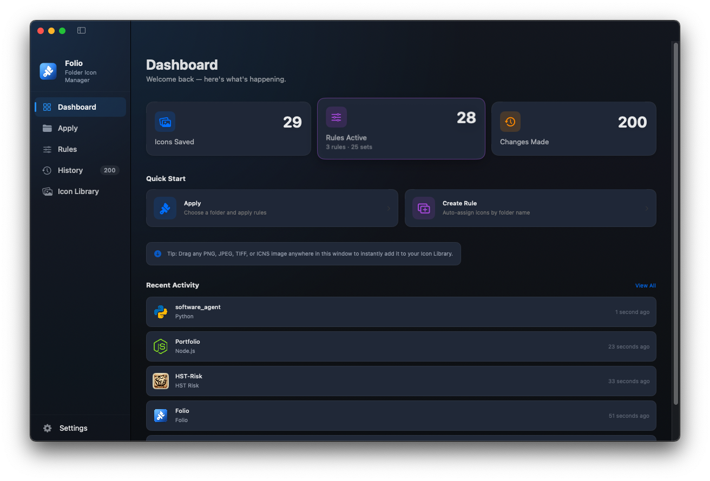
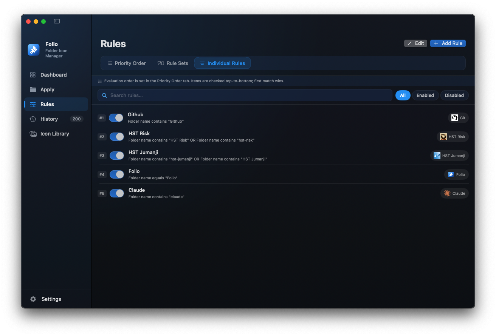
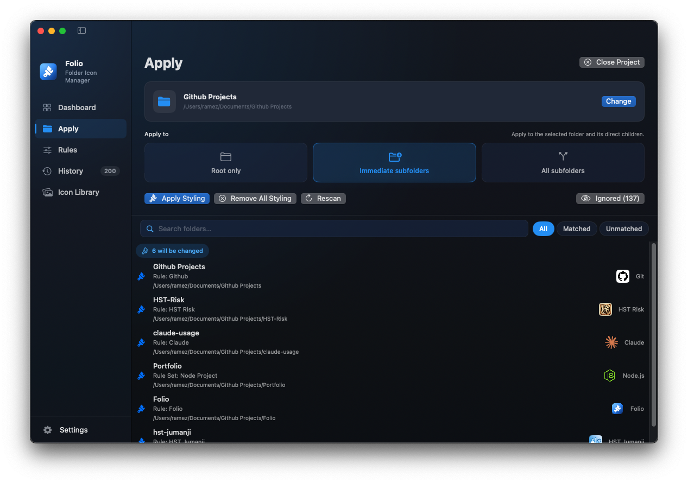
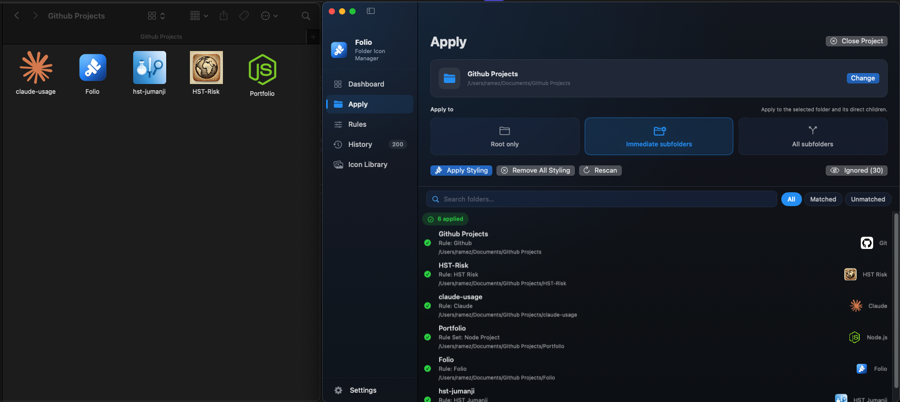

<div align="center">


# Folio

**Give your project folders custom icons and colors — automatically.**

A native macOS menu-bar app that applies custom icons and colors to your folders based on rules and rule sets you define, keeps a reusable icon library, and remembers every change it makes.

</div>

---

## Screenshots

<div align="center">

### Dashboard


### Rules


### Projects — scan & apply


### Result


</div>

---

## Features

- **Icon library** — drag-and-drop any image to build a reusable set of folder icons, organized into categories.
- **Rule sets** — define project-type presets (React, Node, Python, Docker, …) that trigger on a folder name and automatically color-code every subfolder inside it. Folio ships with ~25 built-in rule sets.
- **Individual rules** — match folders by exact name, prefix, suffix, or glob pattern and assign an icon or color.
- **Priority order** — drag items in the Rules view to control which rule wins when multiple match the same folder.
- **Project scanning** — point Folio at any root folder and choose a scan depth (root only, direct children, or fully recursive). A live preview shows exactly which folders will be styled before you commit.
- **Folder colors** — apply tinted macOS folder icons without needing a custom image: blue, green, orange, red, purple, pink, yellow, and gray.
- **History** — every change is logged. Undo individual entries or clear the whole log.
- **Apply Styling / Remove All Styling** — one-click batch apply or full reset for a scanned folder tree.
- **Auto-update** — checks GitHub Releases on launch and prompts when a newer version is available, with in-app download.
- **Menu-bar native** — lives quietly in the menu bar; the Dock icon appears only while the window is open.
- **Launch at login** — optional background startup via `SMAppService`.

## Requirements

- macOS **15.7** or later
- Xcode **16** or later (Swift 5) — to build from source

## Installation

Download the latest `.dmg` from the [Releases](https://github.com/RamezzE/Folio/releases) page, open it, and drag **Folio** to your Applications folder.

## Running locally

```bash
git clone https://github.com/RamezzE/Folio.git
cd Folio
open Folio.xcodeproj
```

Select the **Folio** scheme in Xcode and press **⌘R**.

To build from the command line:

```bash
xcodebuild -project Folio.xcodeproj -scheme Folio -configuration Debug build
```

> **Note:** the auto-updater requires the *Outgoing Network Connections* sandbox entitlement (already enabled in the project) to reach the GitHub Releases API.

## How it works

### Icon Library
Import PNG/JPG/SVG images to build your icon set. Images are stored inside the app's container. You can organize icons into named categories and mark any icon as a favorite.

### Rule Sets
A rule set is a project-type template anchored to a folder. When Folio detects that a scanned folder matches the trigger condition (e.g., it's named `react` or `nextjs`), it:
1. Optionally applies a root icon to that folder.
2. Applies color-coded icons to each subfolder based on the sub-rules defined in the set (e.g., `src` → yellow, `components` → blue, `tests` → red).

Rule sets support a `stopOnMatch` flag so you can decide whether to keep evaluating lower-priority rules or stop on the first match.

### Individual Rules
An individual rule matches a folder by name conditions (equals, contains, starts with, ends with, regex) combined with AND/OR logic. If it matches, it applies an icon, a color, or both.

### Evaluation order
All rules and rule sets share a single priority list. Items higher in the list take precedence. You can drag to reorder in the Rules view.

## Releasing (for maintainers)

1. Bump `MARKETING_VERSION` in the Xcode build settings.
2. Tag the commit with the version number (e.g. `v1.2.0`).
3. Attach one `.dmg` (preferred) or `.zip` asset to the GitHub Release.

The in-app updater reads `https://api.github.com/repos/<owner>/<repo>/releases/latest`, compares the tag against `CFBundleShortVersionString`, and offers **Download & Install**, **Remind Me Later**, or **Skip This Version**.

## Attribution

App and folder icons by **[Freepik](https://www.freepik.com)** from **[Flaticon](https://www.flaticon.com)**.

## Support

If Folio is useful to you, consider buying me a coffee — it helps keep the project going. ❤️

<a href="https://paypal.me/ramezehab" target="_blank">
  
</a>

## License

This project is open source. See [`LICENSE`](LICENSE) for details.
